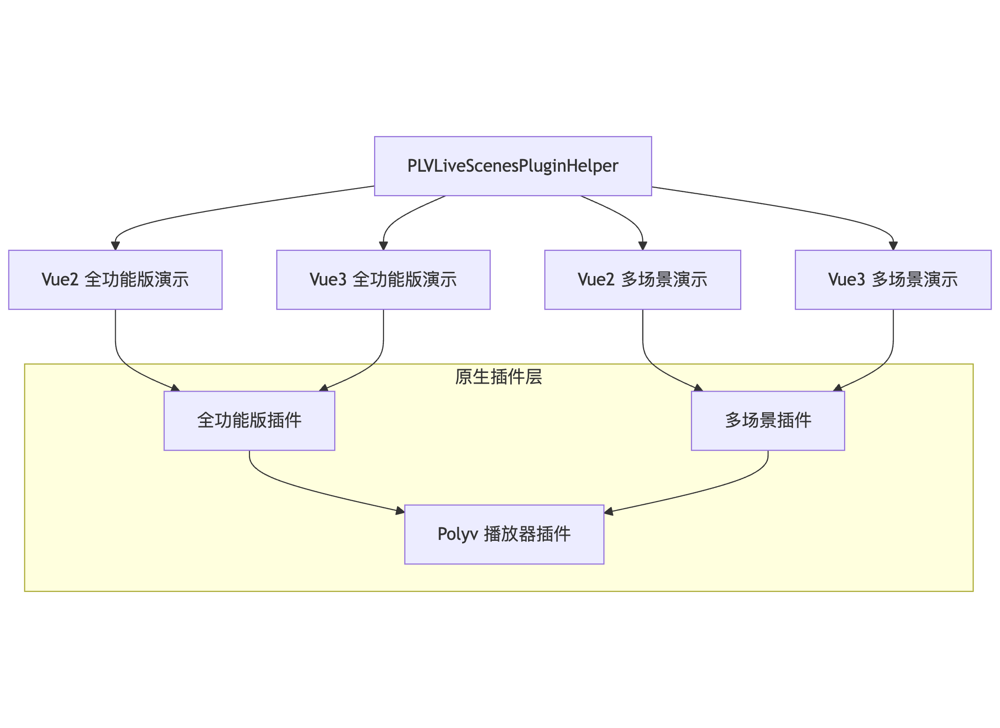

# PLVUniAppLiveScenesDemo 项目目录说明

## 项目概述

本项目是保利威（Polyv）云直播多场景 SDK 的 UniApp 插件演示项目集合，包含多个演示项目和插件助手工具。

## 项目整体结构

```
PLVUniAppLiveScenesDemo/
├── PLVLiveScenesPluginHelper/          # 插件助手工具库
├── PLVUniAppLivePluginDemo/            # Vue2 全功能版插件演示
├── PLVUniAppLivePluginVue3Demo/        # Vue3 全功能版插件演示
├── PLVUniAppLiveScenesPluginDemo/      # Vue2 多场景插件演示
└── PLVUniAppLiveScenesPluginVue3Demo/  # Vue3 多场景插件演示
```

## 详细目录说明

### 1. PLVLiveScenesPluginHelper - 插件助手工具库

**功能描述**：TypeScript 编写的插件助手库，提供统一的 API 接口封装，简化 UniApp 插件的使用。

**目录结构**：

```
PLVLiveScenesPluginHelper/
├── package.json                    # 项目配置和依赖
├── pnpm-lock.yaml                 # pnpm 依赖锁定文件
├── tsconfig.json                  # TypeScript 配置
├── tsdown.config.ts               # TypeScript 构建配置
└── src/
    ├── index.ts                   # 主入口文件，提供单例模式插件助手
    ├── core/                      # 核心模块
    │   ├── base-plugin.ts         # 基础插件类
    │   ├── index.ts               # 核心模块导出
    │   ├── plugin-factory.ts      # 插件工厂类
    │   ├── streamer-plugin.ts     # 主播插件实现
    │   └── watch-plugin.ts        # 观众插件实现
    ├── interfaces/                # 接口定义
    │   ├── index.ts               # 接口导出
    │   └── native-modules.ts      # 原生模块接口
    ├── types/                     # 类型定义
    │   ├── base.ts                # 基础类型定义
    │   ├── index.ts               # 类型导出
    │   ├── plugin-instance.ts     # 插件实例类型
    │   ├── streamer.ts            # 主播相关类型
    │   └── watch.ts               # 观众相关类型
    └── utils/                     # 工具函数
        ├── const.ts               # 常量定义
        ├── logger.ts              # 日志工具
        └── native-modules.ts      # 原生模块工具
```

### 2. PLVUniAppLivePluginDemo - Vue2 全功能版插件演示

**功能描述**：基于 Vue2 的全功能版云直播插件演示，支持手机开播和云直播观看功能。

**目录结构**：

```
PLVUniAppLivePluginDemo/
├── App.vue                        # 应用主组件
├── main.js                        # 应用入口文件
├── manifest.json                  # 应用配置文件（使用全功能版插件）
├── pages.json                     # 页面配置文件
├── README.md                      # 项目说明
├── uni.scss                       # 全局样式文件
├── .hbuilderx/                    # HBuilderX 配置目录
├── common/                        # 公共资源
│   ├── nvue.css                   # nvue 样式文件
│   ├── uni-nvue.css               # uni-nvue 样式文件
│   ├── uni.css                    # uni-app 样式文件
│   └── util.js                    # 工具函数
├── pages/                         # 页面目录
│   └── index/                     # 首页目录
│       ├── index.vue              # 首页组件（提供功能选择）
│       ├── live-streamer.vue      # 手机开播页面
│       └── live-watch.vue         # 云直播观看页面
├── static/                        # 静态资源
│   └── logo.png                   # 应用图标
└── tools/                         # 工具文件
    ├── plv-live-scense-plugin-helper.d.mts  # 插件助手类型定义
    └── plv-live-scense-plugin-helper.mjs    # 插件助手实现
```

### 3. PLVUniAppLivePluginVue3Demo - Vue3 全功能版插件演示

**功能描述**：基于 Vue3 的全功能版云直播插件演示，功能与 Vue2 版本相同，使用 Vue3 语法。

**目录结构**：与 Vue2 版本基本相同，主要区别：

- `manifest.json` 中指定 `"vueVersion": "3"`
- 使用 Vue3 的 Composition API 语法
- 页面组件使用 `<script setup>` 语法

### 4. PLVUniAppLiveScenesPluginDemo - Vue2 多场景插件演示

**功能描述**：基于 Vue2 的多场景插件演示，支持云课堂和直播带货两种场景，提供直播和回放功能。

**目录结构**：

```
PLVUniAppLiveScenesPluginDemo/
├── App.vue                        # 应用主组件
├── main.js                        # 应用入口文件
├── manifest.json                  # 应用配置文件（使用多场景插件）
├── pages.json                     # 页面配置文件
├── README.md                      # 详细使用文档
├── uni.scss                       # 全局样式文件
├── .hbuilderx/                    # HBuilderX 配置目录
├── common/                        # 公共资源
│   ├── nvue.css                   # nvue 样式文件
│   ├── uni-nvue.css               # uni-nvue 样式文件
│   ├── uni.css                    # uni-app 样式文件
│   └── util.js                    # 工具函数
├── pages/                         # 页面目录
│   └── index/                     # 首页目录
│       └── index.vue              # 首页组件（集成直播和回放功能）
├── static/                        # 静态资源
│   └── logo.png                   # 应用图标
└── tools/                         # 工具文件
    ├── plv-live-scense-plugin-helper.d.mts  # 插件助手类型定义
    └── plv-live-scense-plugin-helper.mjs    # 插件助手实现
```

### 5. PLVUniAppLiveScenesPluginVue3Demo - Vue3 多场景插件演示

**功能描述**：基于 Vue3 的多场景插件演示，功能与 Vue2 版本相同，使用 Vue3 语法。

**目录结构**：与 Vue2 多场景版本基本相同，主要区别：

- `manifest.json` 中指定 `"vueVersion": "3"`
- 使用 Vue3 的 Composition API 语法
- 页面组件使用 `<script setup>` 语法
- 包含测试页面 `/pages/test/index.vue`

## 插件配置差异

### 全功能版插件配置（PLVUniAppLivePluginDemo）

- 使用 `PLV-LiveUniPlugin` 插件（插件ID: 18970）
- 提供完整的直播功能，包括手机开播和观看

### 多场景插件配置（PLVUniAppLiveScenesPluginDemo）

- 使用 `PLV-LiveScenesPlugin` 插件（插件ID: 5307）
- 支持云课堂和直播带货两种场景
- 提供直播和回放功能

## 项目架构关系

[]

## 使用说明

1. **插件助手**：所有演示项目都使用 `PLVLiveScenesPluginHelper` 提供的统一 API
2. **功能选择**：
   - 全功能版：专注于直播功能，支持开播和观看
   - 多场景版：支持云课堂和直播带货两种业务场景
3. **技术栈选择**：
   - Vue2 版本：使用 Options API，兼容性更好
   - Vue3 版本：使用 Composition API，现代化开发体验

## 注意事项

1. 使用前需要在 HBuilderX 中配置对应的原生插件
2. 多场景插件需要配置保利威平台的 App ID、User ID 和 App Secret
3. 不同版本的演示项目功能基本相同，主要区别在于技术栈和插件配置
